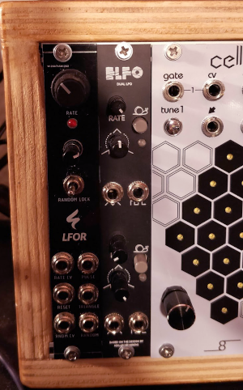

# ELFO
## Simple dual LFO

A dual LFO which offers triangle and square outputs with frequency and
shape (tri-saw or PWM) controls as well as a button to switch between
fast and slow mode. The capacitor values can be tuned to your liking.
Based on [a circuit by Niklas Rönnberg](http://familjenronnberg.se/~niklas/diy/eurorack/lfo/).
My only addition has been a bicolor LED.

The panel is also included and can be ordered from a regular PCB shop,
together with the PCB.

## Components

 * You can check the IBOM for details (`bom` directory);
 * The potentiometers I used were the usual Song Huei you can get from [Thonk](https://www.thonk.co.uk/shop/ttpots/) and other suppliers;
 * I got the 7x7mm switch from a kit I got off AliExpress long time ago, but [this](https://www.aliexpress.com/item/4000834984463.html) looks like it (not confirmed). I suspect it's a clone of the [E-Switch TL2230](https://www.e-switch.com/product-catalog/pushbutton/product-lines/tl2230-series-pushbutton-switches), so buy the original if you can!

## CHANGELOG

 * 2020-04-15 - fixed sizing issues with panel and reworked routes/zones

